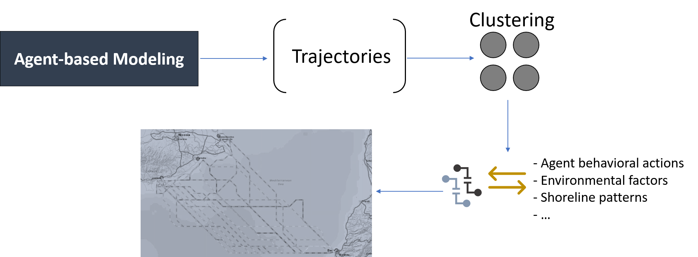

<style>
body {
text-align: justify}
</style>

```{r setup, include=FALSE}
knitr::opts_chunk$set(echo = TRUE)
```

## Topic

This PhD thesis examines the use of present-day geospatial data and advanced computational techniques to study maritime human movement during the early Holocene in the Eastern Mediterranean. As we examine a prehistoric time for which there are no available data, apart from few documented assumptions which can be found nowadays regarding vessel travel details (duration, path, etc.), this topic is considered challenging for both geoscientists and archaeologists. Towards that end, Agent-Based Modeling and Simulation (ABMS) is the most appropriate modeling approach for this purpose and its adoption has increased dramatically during the last decade, as ABMS has been used in a wide spectrum of disciplines (Bazghandi 2012). The existing variety in ABMS research and development applications may be the reason behind the fact that there is a lot of ambiguity by a large part of the scientific community around their nature (Macal 2016).

Our primary purpose is to develop an ABM for maritime movement in the context of prehistoric Mediterranean, whereby simulated vessel trajectories will account several factors that can affect maritime movement (weather conditions, vessel characteristics, time, human cognition). Clustering will be employed to group generated trajectories, and the characteristics of the resulting groups will be associated to environmental conditions, shoreline patters, and possibly to the properties of the agent itself.




## Visualization

AliBaba team has created a visual representation of people mobility using particle flow, where the different colors show the direction they move as well as their velocity. The number of particles in the grid represents the number of trajectories, while the higher the speed, the closer the color is to blue, and the lower the speed, the closer the color is to red. 


Although the aforementioned example is not related to maritime trajectories, it is worth mentioning that it constitutes a really nice representation. Within the aspect of my PhD topic, the generated data (trajectories) will be visualised in such way that will highlight the resulting patterns and connections between them and the external information (behavioral actions / environmental factors). To this end, we will explore also the possibility of linking them to existing archaeological finds in the wider region of the Eastern Mediterranean. To make patterns distinct from each other, different colors will be used depending on the possible maritime routes (port of origin, port of departure, speed, environmental factors).


## Reproducibility

To make my research more reproducible by the wider research community we will take into consideration the Reproducible Guidelines as those were set by AGILE Association. Research's data (trajectories)will be provided in a non-proprietary format, i.e. txt files that will contain arrays with travel details, that will be accessible to a public repository that conforms with "open-access" regulations, possibly under a Creative Commons license to ensure their wider re-use by the research community, having also a well-written documentation explaining in detail the data columns. The developed ABM model or snippets of the code will be available online under the MIT license so to ensure that proper attribution will be given to its creator, whereas the several libaries and software packages that might have been used will be properly aknowledged throughout the project and model's documentation text. The publications that will be derived from the proposed research will be submitted in "open-access" journals / proceedings following the Creative Commons license in order to be publicly available, hence avoiding any publisher restrictions that might limit their availability.  


## Science Communication

My conducted research targets mainly two groups; geoscientists and archaeologists. As it is perceived these 2 groups do not have common points of reference as their expertise majorly differs. To better communicate my research to the first group, the functions and variables of the model need to be highlighted as well as the resulting patterns in relation to the environmental data and shoreline patterns so to better understand the dynamics of the developed model along its potentials and drawbacks as well, while for the latter group the visualisation of the results should be focused on the archaological aspect supporting (or not) any assumptions pertaining to the possible maritime connections and population exchange.

Within this context, the generated trajectories are being regarded as the most important aspect of my PhD topic as they are expected to act as storytelling techniques that will be used to narrate the colonization of the region as well as to discover any links (if any) to the neolithic finds of the region. The key aspect that derives through such visual representation is that readers will acquire a holistic overview on possible connections and colonization of the region during the Holocene era, while provoking possible discussions concerning a nations’ origins.

## _References_

_Bazghandi, A. 2012. “Techniques, Advantages and Problems of Agent Based Modeling for Traffic Simulation.” International Journal of Computer Science Issues 9(1): 115–19_

_Macal, Charles M. 2016. “Everything You Need to Know about Agent-Based Modelling and Simulation.” Journal of Simulation 10(4): 144–56_